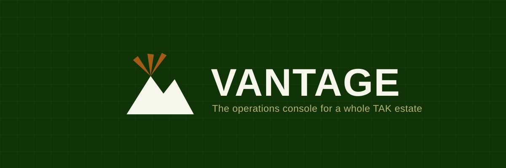
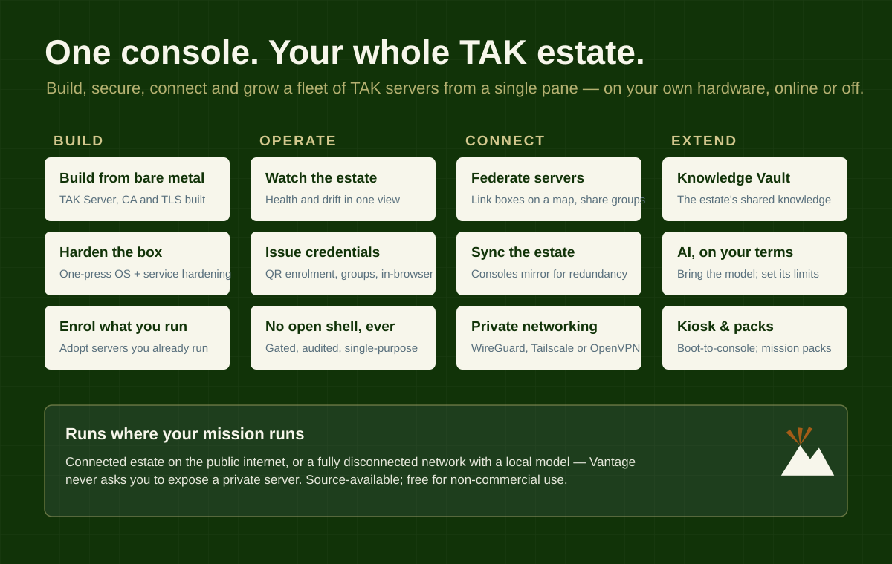
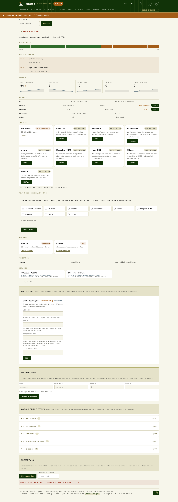

# Vantage

**The operations console for a whole TAK estate.** Vantage builds, secures, connects
and runs every TAK server you operate from one browser tab, on your own hardware, online or
completely offline. It is not a single-server tool: it provisions servers from bare metal,
adopts the ones you already run, issues device credentials, federates and synchronises
servers, holds the estate's shared knowledge, and connects an AI assistant on your terms,
every action gated, audited, and without ever holding an open shell to your estate.

**[Walk the console without installing it](https://vantage.milux.co.uk)** ·
[What it is and who it is for](https://milux.co.uk/vantage/) ·
[User guide](USER-GUIDE.md)

A MilUX product. Source-available; free for non-commercial use.



## More than a TAK server manager

Most tooling stops at keeping one server alive. Vantage manages the whole lifecycle of a
whole estate, and it does three things.

### The estate

- **Build and adopt.** Turn a fresh Ubuntu box into a hardened TAK server, with OS
  hardening, TAK Server, its certificate authority and a trusted TLS certificate, in one
  guided run. Or enrol servers you already operate and manage them in place, installing
  nothing.
- **One estate, one pane.** Every server's health, software drift against your baseline,
  certificates, credentials and modules in a single Overview. No SSH, no dashboards to
  wire up, no agent to babysit.
- **Connect the estate.** Federate servers on a map to share groups; synchronise consoles
  so several can run as masters for redundancy; join boxes to a private network with
  WireGuard, Tailscale or OpenVPN.
- **Get devices on the map.** Issue per-device certificates as QR codes from the browser,
  organised by group, at scale: a whole team enrolled from one page.
- **Field-ready.** Boot a box straight to the console as a kiosk appliance; build and push
  mission and map packs; run entirely disconnected with a local model on a closed network.

### The knowledge

- **Carry the knowledge.** A Knowledge Vault holds the estate's orders, locations, people
  and reference, moves with the estate, and is what an AI assistant reads to answer "what
  do I need to know here?".
- **Onto the handset.** Vantage Deployed, the companion Android app, carries a deployment's
  vault and its mission and map packs to a phone: a device joins by scanning a QR from the
  console's Sync page, stays in step over a signed link, reads, searches, edits and answers
  questions from the vault offline, and hands packs to ATAK. Over LoRa it keeps syncing with
  no network at all. Source under `deployed/`.

### The agent

- **Assist, on your terms.** Connect any MCP-capable AI. You bring the model, so no route
  bills you for the AI itself, and you set exactly how much it may do: observe, propose, or
  act, every call audited under its own name.

**You do not have to take all of it.** The console, the health checks and the gated actions
all work with no AI at all; [MODELS.md](MODELS.md) covers what changes if you add one. And
the skills under [`skills/`](skills/) can be used on your own kit without installing
Vantage at all.


*A server's page, live. The [user guide](USER-GUIDE.md) walks every screen: the build
sequence from a real end-to-end build, the rest from the console as it is now.*

The rest of this guide is the practical path: install the console, build your first
server, get a device on the map, then grow the estate.

---

## What you need

Starting from bare hardware, a router and no box at all? Read
**[the pre-install guide](PRE-INSTALL.md)** first: it covers buying the kit, configuring the
router, getting a name and a certificate, and installing Ubuntu, and it ends with the record
you type into the steps below.

**Or open [`PRE-INSTALL-PLANNER.html`](PRE-INSTALL-PLANNER.html) in a browser and work through
it there.** It is the same guide made interactive: one self-contained file, no server and no
internet, so it runs from a stick on a box that has never been online. Put your details in once
and every command below appears with your values already in it, each labelled with the machine
it runs on. It ends by giving you a **build plan** - one line you paste into the console's
Deploy page so you never type the same fact twice.


- A server running **Ubuntu 22.04 or 24.04 LTS**, reachable on the internet or your
  private network. Both are tested; 2 CPU cores and 4GB of memory are enough to start,
  and 8GB is comfortable.
- **Root access** to that server. Your hosting provider gives you one of two things:
  - an **SSH private key** - save it to a file (for example `~/.ssh/my-server`) and run
    `chmod 600 ~/.ssh/my-server`. Add `-i ~/.ssh/my-server` to every `ssh` and `scp`
    command below.
  - a **root password** - the commands below will prompt for it each time. No `-i`
    needed.
- A **DNS name** pointing at the server (for example `tak.example.org`). Devices connect
  to this name and it becomes the server's certificate, so set it up before you build.
- The **TAK Server release** - `takserver_x.x-RELEASExx_all.deb` from
  [tak.gov](https://tak.gov). TAK software is licensed: you download it under your own
  account, and it only ever enters Vantage as your deliberate upload. Vantage never
  fetches or bundles it.

## Two questions before you install

**Do you already run a Vantage console?** Then stop here - you do not install anything by
hand. Your existing console's **Deploy** page builds TAK servers on fresh boxes and enrols
servers you already run; see [Growing the estate](#growing-the-estate). The install path
below is for your *first* console only.

**Is this box publicly reachable, or private?** A box on the open internet takes the path
below with nothing extra. A private box - a VPN- or tailnet-only server, or a deployable
kit behind its own router - needs its TLS certificate arranged *before* the build; see
[the certificate on private and offline boxes](#the-certificate-on-private-and-offline-boxes).
And the build itself always needs internet access (a full system update and package
installs), even for a kit that will operate offline ever after.

## The certificate on private and offline boxes

Let's Encrypt proves you control a name one of two ways: by reaching your box over the
public internet - impossible for a private box - or by seeing a TXT record appear in your
domain's DNS, which works from anywhere, because your DNS provider is always public. The
build uses the first method; on a private box, use the second *before* pressing Install,
and the build finds the certificate at `/etc/letsencrypt/live/<your-name>/` and skips its
own step.

Three routes, in order of preference for a first box:

1. **Manual DNS-01, from any laptop.** No second server, no API key:

   ```bash
   certbot certonly --manual --preferred-challenges dns -d tak.example.org
   ```

   Certbot prints a TXT record and waits; paste the record into your DNS provider's web
   page; press Enter; the certificate is issued onto the laptop. Copy
   `/etc/letsencrypt/live/tak.example.org/` and `/etc/letsencrypt/archive/tak.example.org/`
   to the same paths on the box, preserving the live-to-archive symlinks (carry them with
   tar, not cp). Renewal is manual, roughly every sixty days.

2. **A DNS API token.** certbot has a plugin for most DNS providers (`--dns-<provider>`)
   runs scripted and renewable wherever the token lives. Decide deliberately where that
   is: the token can edit your DNS, and putting it on a field box means shipping it.

3. **No public certificate at all.** TAK's own CA already secures the device ports with
   mutual TLS; the public certificate only buys a warning-free browser on the enrolment
   port. A genuinely closed network can run on the server's own CA and accept the warning.

Whatever the route, renewal cannot run on a box the internet cannot reach: re-issue
off-box and re-copy before the expiry date, and write that date somewhere you will meet
it. An expired certificate in the field is indistinguishable from a dead server.

Two testing notes for kits behind their own router: keep the WAN connected for the whole
build, and note that many travel routers intercept port 53 from their LAN clients - test
the public face of your DNS from outside the kit, or over DNS-over-HTTPS.

## Install the console

Vantage releases on the **0.9.x** line through the beta. The products inside it carry
their own baselines - the console and the health checker each version independently - so
the release number and a component's number are not the same thing and are not expected
to match.

Always install the latest release. This fetches it, verifies it against its published
checksum, and copies it to the server. There is no version number to look up or type: it
prints the one it found. Run it on your own machine.

```bash
TAG=$(curl -fsSL https://api.github.com/repos/MilUX-Ltd/vantage/releases \
        | sed -n 's/.*"tag_name": *"\([^"]*\)".*/\1/p' | head -1)
echo "Installing $TAG"
curl -fsSLO "https://github.com/MilUX-Ltd/vantage/releases/download/$TAG/vantage-${TAG#v}.tgz"
curl -fsSLO "https://github.com/MilUX-Ltd/vantage/releases/download/$TAG/vantage-${TAG#v}.tgz.sha256"
shasum -a 256 -c "vantage-${TAG#v}.tgz.sha256"   # must print one line reading OK
scp "vantage-${TAG#v}.tgz" you@your-server:~/
```

If the checksum line does not read `OK`, stop. Then on the server. `$TAG` is not set in
that session, so the version is written out in full: a wildcard would match every release
already sitting there and tar would treat the extras as members to extract, which fails
with `Not found in archive`.

```bash
ssh you@your-server
tar -xzf vantage-<version>.tgz          # the file you just copied, named in full
cd vantage/console
sudo ./install-vantage.sh --bind YOUR.SERVER.IP.ADDRESS
```

To browse the releases yourself, or to install an older one deliberately, the
[Releases page](https://github.com/MilUX-Ltd/vantage/releases) lists them newest first.
Note that every 0.9.x release is marked pre-release through the beta, so GitHub's
"Latest release" badge does not appear and `/releases/latest` lands on the list rather
than on a release. That is why the command above reads the list instead.

Install as your own account with `sudo`, or as root if your provider gave you root
directly. A stock Ubuntu Server has neither a root password nor root SSH, so `sudo` is the
usual route.

`--bind` decides where the console listens. Use the server's address to reach it from
your browser; leave it off to bind to localhost only (for use behind your own reverse
proxy or VPN). It is also the address a kiosk on this box points its browser at, so on a
box taking a DHCP lease, reserve the address before you install. The installer is
idempotent - re-running it updates the code and leaves your configuration alone.

Two minutes later:

```
Vantage is running on http://YOUR.SERVER.IP.ADDRESS:8090
```

## First run

Open that address in a browser.

1. **Set the operator password.** This is the first screen, and nothing else is
   reachable until it is done. One password signs you in and confirms every privileged
   action afterwards. Use at least 12 characters - a phrase of three or four unrelated
   words is strong and easy to type.
2. **Make it yours (optional).** The gear, top right: name the console, set your
   colours, and fill in the certificate identity your builds will carry (organisation,
   unit, country). Anything you set here prefills every build.
3. **Build your first TAK server.** The empty Overview *is* the build screen:
   - Upload the TAK Server `.deb` (a progress percentage keeps you honest - it is a
     large file).
   - Fill in the server's public name (your DNS name), a certificate email, and the
     certificate identity.
   - Press **Install TAK Server**. If you would rather see what will happen first,
     **preview (dry run)** prints every step without changing anything.

The build runs nine stages and narrates each one in plain language as it goes -
securing the operating system, installing the foundations, installing TAK Server,
building its certificate authority, obtaining a trusted TLS certificate for your name,
and starting it up. **20 to 30 minutes is normal**, most of it in the first stage
(a full system update) and the last (TAK Server's first boot, which can be quiet for
up to 15 minutes). If the page loses contact it says so and keeps retrying; the build
continues on the server regardless.

If TAK Server is *already* running on the box, Vantage notices and offers **Enrol this
box** instead - it starts managing what you have, and installs nothing.

## Connect your first device

From the server's page on the console:

1. **Enrol device** - give the device a name and a group, confirm with your operator
   password.
2. You get a **QR code**. Scan it with ATAK (or use the iTAK line it prints).
3. The device receives its own certificate from the server and appears on the map.

Groups matter: devices see only their own group's traffic. Credentials can be listed
and re-downloaded later from the same page - names and dates are shown freely; the
secrets need your operator password.

## Growing the estate

Everything else lives in the same console:

- **Deploy** builds TAK servers on *other* fresh boxes (paste that box's root key once;
  it is destroyed the moment the build succeeds) and enrols servers you already run. Its first
  step takes the **build plan** from the pre-install planner, so the box's name, address, admin
  user, posture and components fill themselves in; the console shows you what it read before
  anything is saved.
- **Every server's page** shows its health, software against your chosen baseline, an
  upgrade button when a newer TAK release is in your library, modules you can add
  (CloudTAK's web map, MediaMTX video), its security posture with one-press hardening,
  and its credentials.
- **Federation** is a map: drag one server onto another to connect them.
- **Store** holds files for your devices - mission packs, map packs, and an app shelf
  your devices can browse directly at `/eud` (a QR on the Store page takes them there).
- **Overview** is the one screen that answers "is everything alright?".

## Connecting an AI assistant

Vantage ships **an agent role and four skills**, so an AI you connect starts knowing the job
rather than improvising against a tool list. See **[AGENT.md](AGENT.md)** for the full list of
what it can read, what it can do, and what it will never do, and **[MODELS.md](MODELS.md)** for
what size of model the job actually needs.

In short: `vantage-agent` reads your estate, diagnoses what is wrong, and either proposes the fix
or carries it out, depending on the autonomy you set. It comes with `vantage-lessons`
(diagnosis, and which signals are worth believing), `vantage-redteam` (a security review that
changes nothing), `update-estate` (where you stand against a release) and `estate-brief` (the
standing brief it reads each session). They live in `agents/` and `skills/`, so you can read
exactly what your agent has been told before you connect it.


The Agent tab is a connection hub: you decide how AI connects and how much it may do.
Nothing is mandated - the model that thinks is always the one you bring, so no route bills
you for the AI itself.

**First, be honest about your posture.** A *connected* estate is one you are happy touches
the internet: cloud connectors and an API key are legitimate there. A *disconnected*
estate - private network, deliberately offline - should use a resident agent with a local
model, and nothing else. Vantage will never ask you to expose a privately hosted server to
the internet; anything that would is the wrong tool for that estate.

- **Autonomy, per connection:** *Observe* (reads the estate and vault, changes nothing),
  *Propose* (suggests gated actions a human confirms - the default), or *Act* (runs its
  allowed actions directly, every call audited under the connection's name).
- **MCP socket** (works today): point any MCP-capable agent at the console - Claude Desktop,
  Claude Code, or a claude.ai / Cowork custom connector. Create a connection, and the console
  mints a token (shown once) and hands you the exact config to paste. The agent connects over
  your own subscription.

  Cloud connectors (claude.ai, Cowork) require **https and a publicly reachable address**.
  Both are one step from the console:
  - *Box with a public DNS name*: the build already earned a trusted certificate; press
    **Serve HTTPS with this box's certificate** on the Agent page and the console restarts
    on https at the same port.
  - *Private box (VPN or tailnet)*: a cloud connector needs a public https front door,
    and every tunnel that provides one widens your attack surface. Prefer Claude Desktop
    or Claude Code from inside the network. The estate-native answer - publishing a
    private console's socket through a public peer console you already run - is the
    designed next step; third-party tunnels are deliberately not recommended.
- **API key:** paste an Anthropic-compatible key and a chat appears in the console - the
  assistant reads the estate and the vault and answers, at the autonomy you set. Your key,
  your cost; the key is stored only on the box. The conversation is kept on the console,
  so a refresh loses nothing; New conversation clears it deliberately.
- **OpenClaw / resident agent:** a standing agent on a box, for closed networks and local
  models - connects over MCP like any other.

Whatever the route, the tools it gets are the same: read the estate's health, servers and
credentials, search and read the **knowledge vault**, and - by autonomy - propose or run
gated actions. A live activity feed on the tab shows everything it does.

## The Knowledge Vault

The vault is the estate's knowledge, and it is what an assistant reads to answer "what do I
need to know here?". Start it from a template: the template cards scaffold a folder
structure with seed notes - a Deployment pack (orders, locations, people, equipment,
reports, reference), an Exercise pack, or Blank with guidance - or paste your own structure
as JSON. A **Graph view** shows the vault's shape: folders, notes and the [[wikilinks]]
between them; click a note in the graph to open it. Deleting a note is undoable (it moves
to a trash the Undo button restores from).

The assistant's own identity lives here too: an **Agent Context** folder holds three notes -
Identity, Standing Orders, About this estate - that every connected AI reads before
answering. Shaping your assistant is just editing them.

## How Vantage treats security

- The console holds **no general SSH access** to the servers it manages. Every action
  travels over its own single-purpose key that can run exactly one audited command on
  the target - a catalogue, never a remote shell.
- Bootstrap credentials (the root key used to build or enrol a box) are **destroyed on
  success**, automatically.
- Every action is **logged**, dangerous ones ask for the operator password again, and
  reads are separated from writes.
- The console never phones home, fetches software for you, or talks to anything you
  did not point it at.

## Troubleshooting

| Symptom | Likely cause and fix |
|---|---|
| Browser cannot reach the console | The firewall on the box. `ufw status` should list the console port (8090 by default); `ufw allow 8090/tcp` if not. |
| Build page says it lost contact | The build continues on the server. Refresh; if it persists, check the firewall as above. |
| Device scans the QR but cannot connect | The usual cause is your provider's own cloud firewall: devices need **8089/tcp** (and 8446/tcp) open there, not just on the box. Then give the server two minutes after any restart and retry. |
| "Set the operator password first" on APIs | Visit the console in a browser and complete the welcome screen. |
| The build fails at the certificate stage on a private box | Let's Encrypt could not reach the box - behind a router it never can. Pre-issue the certificate by DNS-01 and place it on the box first; see [the certificate on private and offline boxes](#the-certificate-on-private-and-offline-boxes). |
| Deploy's connection test refuses a key you placed | The placement command targets the **Admin user** field's user, and bootstrap keys are filed by **Estate name** - if either field changed (or reset) since you placed the key, the test is using a different key. Restore the fields, press Generate (it returns the existing key for that name), and test again. |
| Forgot the operator password | On the server: `rm /etc/vantage-console/auth.json`, then visit the console - the welcome screen returns. Root access on the box is the recovery key, deliberately. |
| The build failed | Read the last lines of the log on the build screen; fix what it names (a DNS name not pointing at the box is the most common), then run again - completed stages are skipped. |

## Removing a server, or starting over

A server that has been destroyed or reset is removed from monitoring on its own page
(the collapsed "Remove this server" section - operator password required). Nothing is
done to the box itself, so it works whether or not the box still exists. To remove the
console from a box entirely, stop and disable the `vantage-console` services and delete
`/usr/local/lib/vantage-console`, `/var/lib/vantage-console` and `/etc/vantage-console`.

## Licence

Vantage is **source-available**, not open-source. It is free for personal, hobby, and
other non-commercial, non-production use under the **Vantage Community Licence** (see
[`LICENSE`](LICENSE)). Any commercial, governmental, military, or **production** use,
including use by or for the UK Ministry of Defence, requires a commercial licence from
MilUX Ltd. To arrange one, contact **matt@milux.co.uk**.
