# Vantage Field Guide

What the console does, screen by screen, and what happens underneath when you press the
button - illustrated with live captures from a real end-to-end build (a fresh Ubuntu box
to a device on the map, entirely through the browser). Captured against console
1.57.2 on a fresh Ubuntu 22.04 box, built end to end through the browser.

Vantage is MilUX's fleet management system for TAK servers: one place to build, watch,
operate, upgrade and federate every TAK server you run, from a browser. It turns a fresh
Ubuntu server into a running TAK server without an open shell, then grows with you.

Three ideas shape everything:

1. **Health is what a service produces.** The checker never trusts a green light from
   systemd. It looks at what each box actually serves: ports answering, certificates valid
   on the wire, tilesets present, federation carrying traffic.
2. **A catalogue, never a remote shell.** Every operation is a single-purpose SSH key
   locked to a forced command, handing one validated request to a privileged wrapper on the
   box that re-validates it again. Two gates, both on the box's side.
3. **The operator sets the leash.** A connected AI reads the estate and the Knowledge
   Vault, and does exactly as much as you allow: observe, propose (a human confirms), or
   act - chosen per connection, changeable any time, everything audited.

## First run

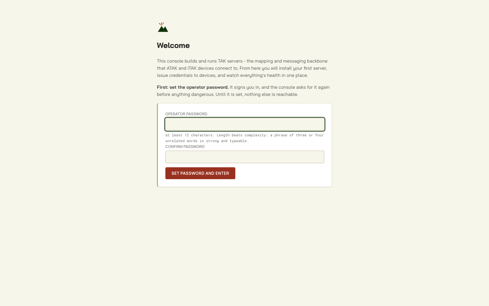
*The welcome gate on a fresh install: nothing else answers until the operator password exists.*

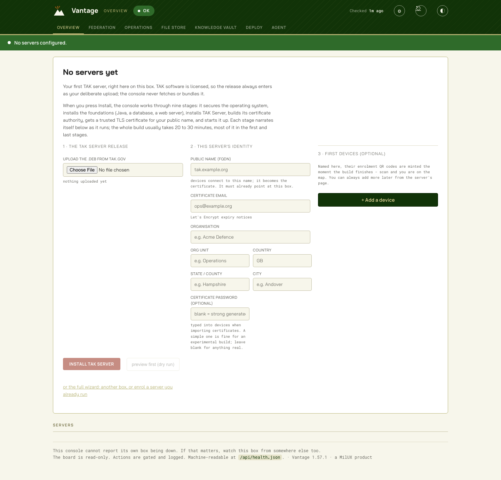
*The empty Overview is the build screen: release, identity, first devices, one Install button.*

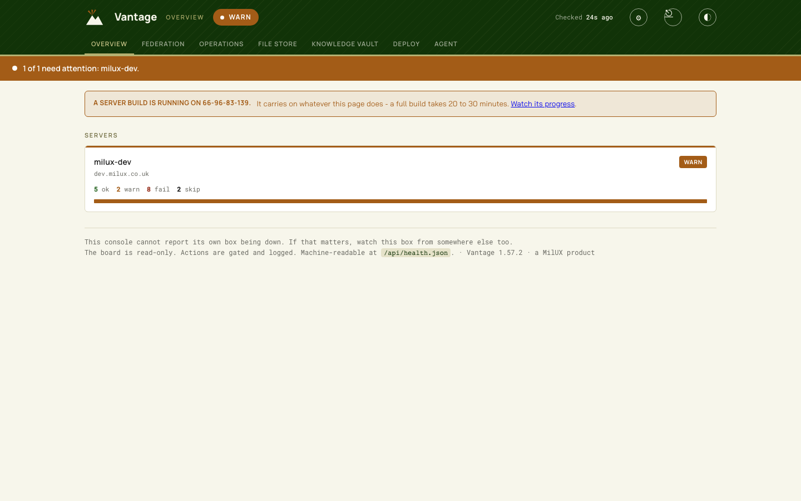
*Mid-build: the running-build banner, and the enrolled box reporting honestly.*

The console's first screen is the **welcome gate**: set the operator password and nothing
else is reachable until you do. One password signs you in and confirms every dangerous
action afterwards; the hint on screen is honest - length beats complexity, and a phrase of
three or four unrelated words is strong and typeable. A **Sign out** control lives in the
header from then on. Forgot it? Root on the box deletes `/etc/vantage-console/auth.json` and
the welcome screen returns - root access is the recovery key, deliberately.

Signed in, the empty Overview **is** the build screen. Three numbered steps on one page:

1. **The TAK Server release.** Upload the `.deb` from your own tak.gov account - TAK
   software is licensed, so the release only ever enters Vantage as your deliberate
   upload; the console never fetches or bundles it. A progress percentage keeps the large
   file honest, and once a release is on the shelf the picker offers it to every later
   build and upgrade.
2. **This server's identity.** The public DNS name devices will connect to (it becomes
   the server's certificate), a certificate email for expiry notices, and the PKI
   identity - organisation, unit, country. The moment you leave the name field, the
   console checks DNS and tells you plainly: "resolves to this server", or a warning
   naming the failure that would otherwise arrive twenty minutes into the build. An
   optional certificate password protects every `.p12` the server will issue; leave it
   blank and a strong one is generated (the console can reveal it later, gated).
3. **First devices (optional).** Name and group per row; their enrolment QR codes are
   minted the moment the build finishes.

Press **Install TAK Server** (or **preview (dry run)** to watch every step with nothing
changed). The build runs nine narrated stages - securing the operating system, installing
the foundations, installing TAK Server, building its certificate authority, obtaining a
trusted TLS certificate, starting it up - with plain-language narration as each stage
turns. **Twenty to thirty minutes is normal**, most of it in the first stage (a full
system update) and the last (TAK Server's first boot, quiet for up to fifteen minutes).
The page says so up front, and refreshing is safe: the build continues on the server and
the Overview carries a link back to the live log. If TAK Server is already running on the
box, the console notices and offers **Enrol this box** instead - managing what you have,
installing nothing.

When it finishes: QR codes for your first devices, on screen with Save buttons. Scan with
ATAK and the device receives its own certificate from the server and appears on the map.

## Overview

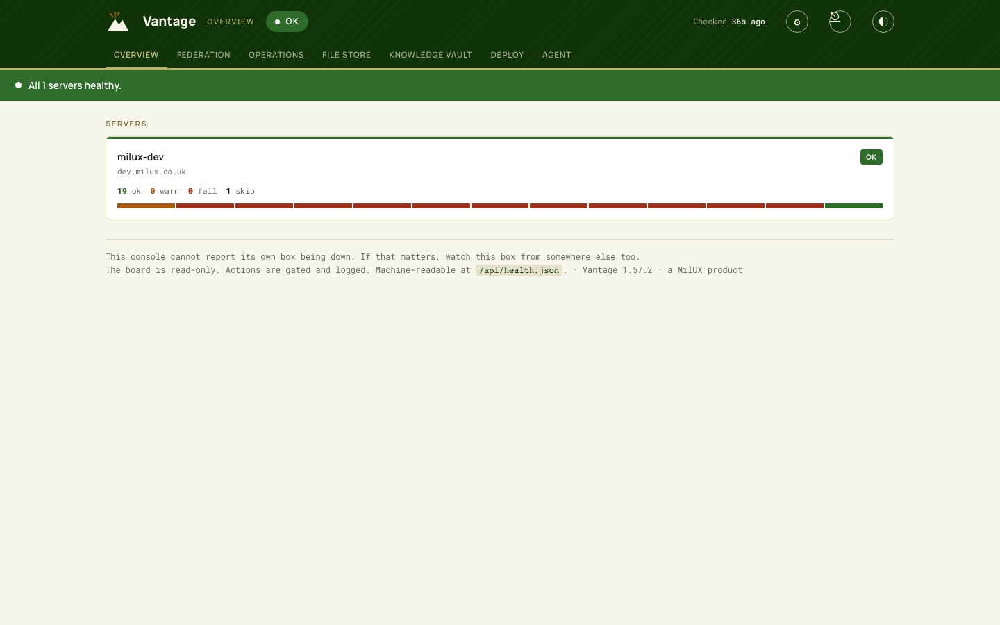
*The estate after the build: one healthy server, checks green, the tile carrying its history strip.*

One screen answering "is everything alright?": a verdict band, one tile per server with
check counts and a 48-hour history strip, a drift banner when any component falls behind
the software baseline, and the baseline table. An enrolled-but-unbuilt box shows Awaiting
Build rather than a false failure. A populated estate refreshes itself in place; the
first-run form never does - a form is not a monitor.

## A server's page

*A server's page: health in full, software against the baseline, modules, security posture, Add a device.*

Everything about one box, every action pre-bound to it. In order: the display name (yours
to change; the estate name stays the stable identifier), health checks in full, the
software inventory against the baseline, modules, security posture - then the two panels
the page exists for:

**Add a device.** The promoted card: name, group, confirm with the operator password, and
you get a QR code (with Save QR and Save iTAK line buttons) plus the device's one-time
password. Groups matter: devices see only their own group's traffic.

**Credentials.** Lists itself on arrival: every client certificate and enrolment token
this box has issued, names and dates freely, the secrets gated behind the operator
password for re-download. **Show certificate password** is a gated action beside them -
what a device asks for when importing a `.p12`; revealed on screen, audited, and honest
on a box the console did not build.

**Modules** shows what else the box runs - CloudTAK's web map and missions stack, MediaMTX
for video - with one-press install where the box has a public name (and a plain sentence
telling you to set one where it does not). **Security posture** reads the box's hardening
state and offers Harden / Revert as stated, confirmed steps; **firewall drift** is its own
read-and-reconcile pair. **Upgrade TAK Server** takes a package straight from the shelf -
a picker that fills the name and checksum itself, and an upload control right on the card -
then backs up CoreConfig, certificates and the database, installs in place, migrates the
database (PostgreSQL major jumps included), and waits out the long first boot. A failed
upgrade is recovered by pressing Run again; every step heals half-done state. **Remove
this server** sits at the bottom, password-gated, and touches only the console's records -
it works whether or not the box still exists.

## Deploy: growing the estate

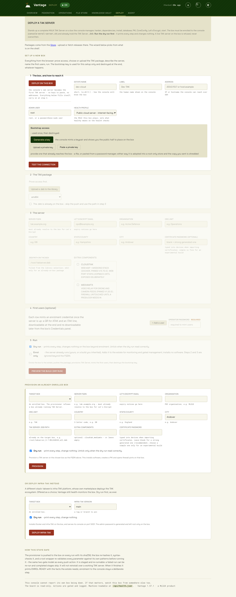
*The Deploy wizard: bootstrap access, package, identity, first users, and a button that says which mode it is in.*

A deployment is a named record on the server, not page state: the strip above the wizard
lists deployments in progress, and one click reopens a form exactly as left, with a
running build's log reattached. Five steps: the box and how to reach it; the TAK package
from the shelf; the server's identity; optional first users; then **Build the server for
real** (tick **Dry run** to preview every step with nothing changed - the button says
which it will do). The health profile speaks operator language: public cloud server,
private network server, or deployable kit.

**Reaching the box** is the journey's one terminal moment, and the wizard owns it. The
admin user is root *or any passwordless-sudo user* - no need to enable root SSH. Choose a
console-minted keypair and the wizard renders the exact placement command, already
targeted (`ssh <user>@<address> '...'`), with a Copy button: run it from any machine that
reaches the box, press **Test the connection**, and every step after is the browser.
(Uploading or pasting a key that already reaches the box works too - either way the key
is held root-only, used for this build alone, and destroyed the moment a live run
succeeds.) The package is pushed to the admin user's own home and verified by hash at
both ends; the provisioner is told the path the push actually used.

**Enrol a server I already run** joins an existing TAK server for monitoring and
management - nothing installed, the bootstrap key shredded after enrolment. **Or deploy
infra-TAK instead** hands the box to the infra-TAK installer for a single-box stack that
its own console then manages.

## Operations

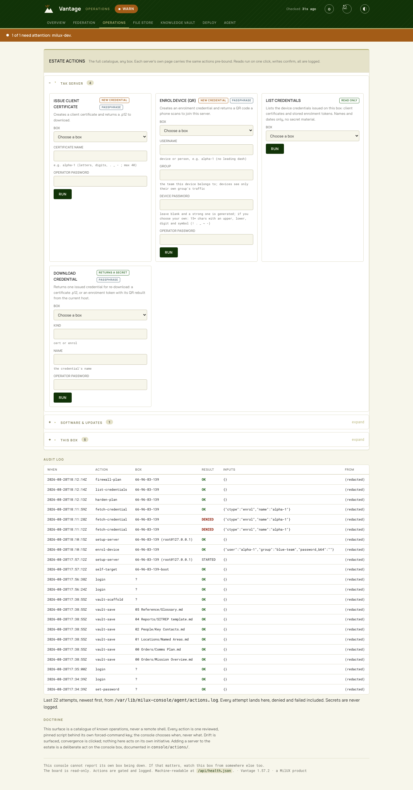
*Operations with the TAK server group open - and below, the audit log carrying the day's actual trail, denials included.*

The estate, and the trail of what has been done to it. Operations lists the same servers
Overview does; open one and its own page carries the full action set, already bound to that
box. A few quick links on each tile - Logs, Restart, Certificates, Add device - jump
straight to the common ones.

A box is the unit of work, so there is nothing to manage here but the servers themselves.
Reads run on one click; writes state their consequence in a confirmation sentence and ask
again; credential-minting actions require the operator password. Every run and refusal
lands in the audit log below.

## Federation

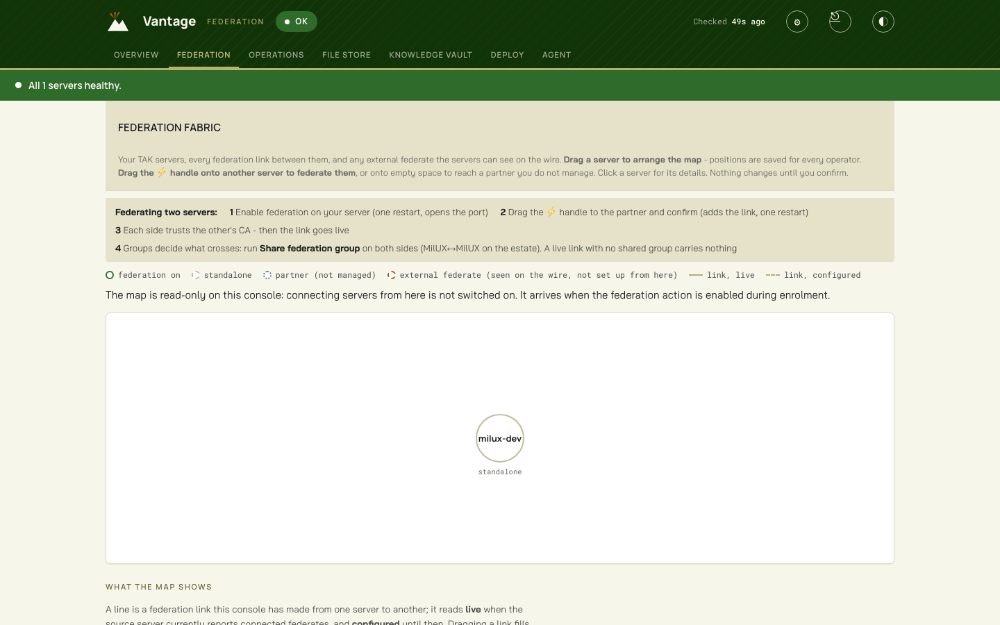
*The federation map: external federates appear here as they are seen on the wire.*

The map shows managed servers, external federates seen on the wire, and the federation
between them. Drag a node to arrange; drag the connect handle from one server to another
to federate, with enable, connect and CA trust as stated, confirmed steps.

Two servers that have each dialled the other are one federation, drawn as one line with an
arrowhead at each end. **An arrow shows who dialled whom, and one arrow is a complete
link**: federation is not one-way, so events cross both ways once the connection is up and
both sides share a group. A line with no arrow is a federate the servers can see connected
that was not set up from this console, so nobody here knows which side dialled.

Every link says what crosses it, because a federation link with no shared group is
connected and carries nothing, silently. Group sharing is its own gated action, run on both
sides; the map reports the group this console set and says plainly when it is set on one
side only. Under the map, the same links are listed as a table: servers, direction,
connection, what crosses, and where it dials.

A link reads **live** only when the checker can see the far end in that server's connected
peers. A server with one federate and five recorded links shows one live link, not five.

## Networks: the Meshtastic mesh

Networks is the bearer layer: radio networks that devices ride, distinct from Federation's
TAK-to-TAK links. The first network type is a Meshtastic LoRa mesh - £40 trackers and
phones reaching TAK with no internet, no SIM and no infrastructure, bridged by a gateway
radio on one of your boxes.

The page carries the whole journey. The kit guide says what to buy (a Heltec V4 gateway
radio on USB, Seeed T1000-E trackers on Meshtastic 2.6.11) and how to stand it up. Channels
are minted on the page - a name and a 256-bit key - and devices join by scanning the
channel's QR in the Meshtastic app; the key itself never appears on the page, only inside
the QR. Deploying the gateway is one confirmed job: pick the box, the radio's by-id path,
the region, the channel and the TAK filter group, and the console pushes the vendored
gateway bundle from the Store shelf (hash-verified at both ends), builds its environment
offline, programs the radio, creates the TAK input with its filter group at creation, and
starts the service. TAK Server restarts once.

Region is a legal setting: pick the region of the country you operate in, and re-check
before transmitting abroad. Rotating a channel mints a new key - devices on the old one
drop until they scan the new QR, and the gateway takes the change through the "apply
channel" action, a brief mesh outage.

The Overview tile shows the mesh line only when it has something honest to say: a gateway
that has forwarded traffic shows the node count; a running gateway that has never
forwarded shows quiet, because a service being active proves nothing about a radio mesh.
The proof that matters is a marker from a tracker on a client that signed in normally.

## File store

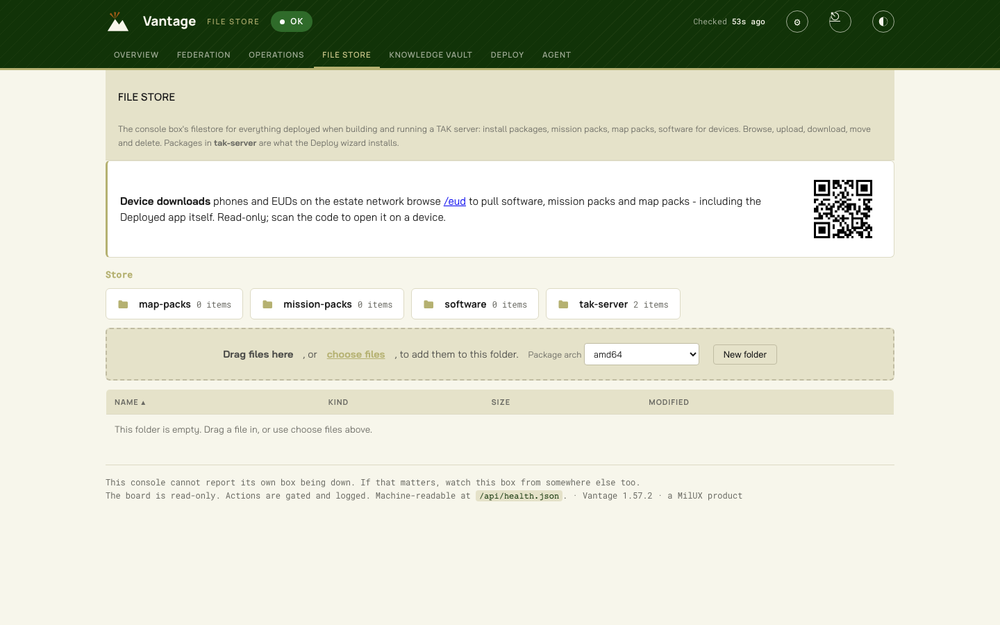
*The File store: the uploaded TAK release on the tak-server shelf, with its checksum recorded.*

The estate's shelf, browsed like a desktop file manager: shelf tabs (tak-server,
mission-packs, map-packs, software) that stay put with the current one lit, sortable
columns, type icons, friendly dates, double-click to open or download, and a selection
toolbar - Download, Move, and a Delete that looks like what it is. Server packages record
sha256, size and architecture on arrival, and every push to a box is verified at both
ends. Devices browse the same shelf directly: **/eud** is a read-only downloads page for
phones and EUDs on the estate network - software, mission packs, map packs - with a QR on
the File store page that opens it on a device.

## Knowledge Vault

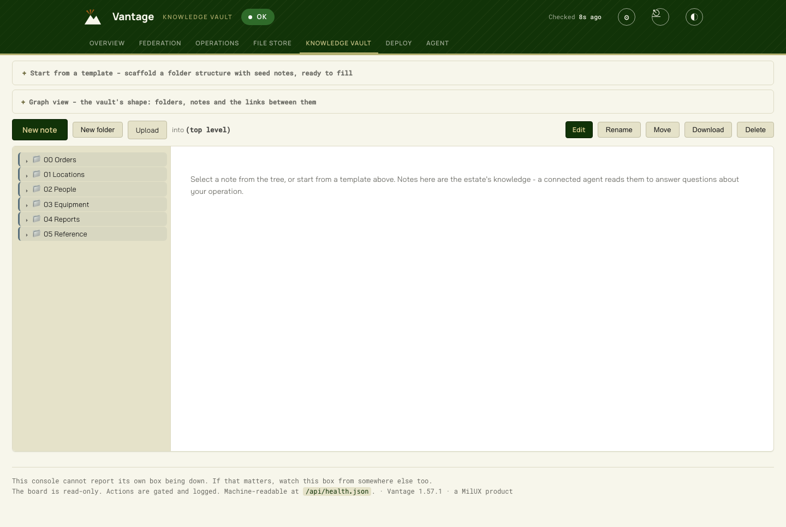
*The Knowledge Vault after scaffolding the Deployment pack: templates above, the tree below.*

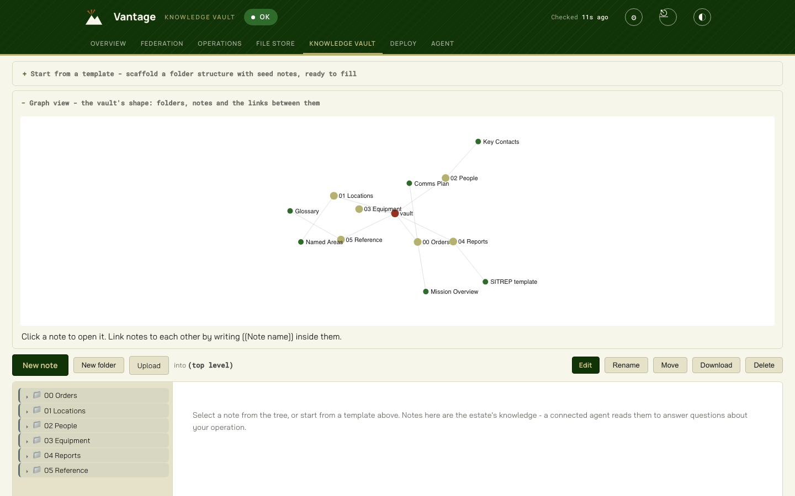
*Graph view: the Deployment pack's shape, wikilinks drawn between notes.*

The estate's knowledge, readable and writable in the console, and what a connected agent
reads to answer "what do I need to know here?". An empty vault opens with **Start from a
template**: a Deployment pack (orders, locations, people, equipment, reports, reference,
with seed notes), an Exercise pack, Blank with guidance - or paste your own folders-and-
notes structure as JSON. Nothing you later write is ever overwritten by a template.

The tree browses folders and notes; markdown renders properly; wikilinks navigate; **New
note** creates instantly and **Rename** names it after the fact - no dialogs. Deleting a
note is undoable: it moves to a trash the Undo button restores from, which matters in a
vault whose changes sync onward. **Graph view** draws the vault's shape - folders gold,
notes green, `[[wikilinks]]` between notes as warm links; click a note in the graph to
open it.

One folder is special: **Agent Context** seeds itself with three notes - Identity,
Standing Orders, About this estate - and every connected AI reads them before answering.
Shaping your assistant is just editing notes.

## Vantage Deployed: knowledge on the handset

Vantage Deployed is the companion Android app. It carries a deployment's knowledge vault
and its mission and map packs onto a phone or tablet, keeps them in step with the box over
a signed link, and lets an operator read, search, edit and query the vault in the field,
offline. Its source is under `deployed/`; the app itself reaches devices from the File
store, never from the console over the wire.

**Enrol a device.** The Sync page has a Devices section: this is where handsets join the
box. Enrol a device names it and the deployment or deployments it should carry, and mints
a single-use QR that lives for minutes. The holder opens Vantage Deployed, scans it, and
reads back a six-digit code shown large on their screen. You confirm that code against the
one on the page, and only then is the device on the roll. It is the Bluetooth-pairing
gesture, a number a person can actually say rather than a fingerprint to recite. Revoke
ends the binding when a deployment finishes; the device is refused from then on.

**What a device receives.** Exactly its deployment's folder from the Knowledge Vault, at
or below the content ceiling it was enrolled with, together with every pack shared to that
deployment from the File store. The What moves section on the Sync page spells this out per
device. Sharing is decided where the content lives: a folder in the vault, and Shared to
deployments on the File store. Nothing else on the box is visible to the device.

**On the handset**, the app opens on the vault's ways of working. Ask gives a grounded
answer drawn from the notes the device holds, entirely offline; with an on-device model
provisioned it writes the answer, and without one it surfaces the closest notes, always
filtered to the content ceiling and failing closed. Vault Viewer shows the deployment's
notes as a tree with markdown rendered and wikilinks you can follow. Knowledge graph draws
the deployment's entities and orders, coloured by kind. Capture records a person, place or
note. Packs hands a mission or map pack to ATAK through the share sheet. Sync pulls what
changed and pushes local edits.

**Editing in the field.** A note edited on the handset reaches the box on the next sync,
based on the version it was received at. If the box changed the same note in the meantime,
the vault keeps one version and stages the other for the operator to settle on the
Conflicts screen: keep mine, or take theirs. The vault never holds two copies of a note.

**One device, several deployments.** A device may carry more than one deployment and syncs
all of them; the operator then picks which to view, so the viewer and graph show a single
operation's detail while everything stays current underneath.

**Off the network.** Where a kit has LoRa radios, the mesh bearer carries vault content to
the handset with no network at all, one file at a time. The signed link, the deployment
scope and the content ceiling hold the same over the mesh as over IP. The app is designed
for landscape, because the device is expected to ride on the chest.

## The Agent

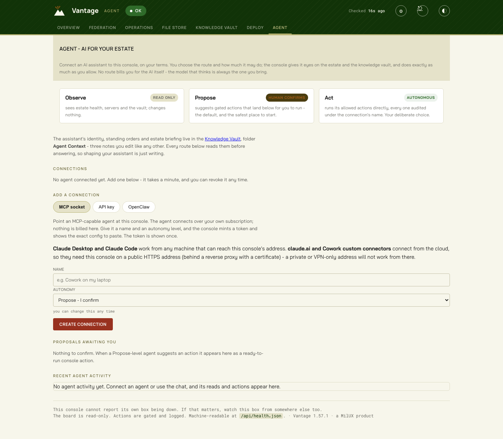
*AI Connections: the autonomy dial explained, the connection routes, and the live activity feed below.*

The Agent tab is a connection hub: you decide how AI connects and how much it may do. No
route bills you for the AI itself - the model that thinks is always the one you bring.

**The autonomy dial**, set per connection: **Observe** reads the estate and vault and
changes nothing. **Propose** suggests gated actions that land on this page for you to
run - the default, and the safest place to start. **Act** runs its allowed actions
directly, every call audited under the connection's name.

**MCP socket** (works today): point any MCP-capable agent at the console - Claude Desktop
or Claude Code from any machine that can reach this address; claude.ai and Cowork custom
connectors need the console on a public HTTPS address. Create a connection and the
console mints a token - shown once, stored only as a hash, revocable - with the exact
config to paste, and a **Test from this browser** button that proves the token before you
wire anything. The tools an agent gets: estate health, server detail, credentials (names
only), the action catalogue, vault search and read, and its own standing context - plus
propose or run, by autonomy.

**API key**: paste an Anthropic-compatible key and a chat appears right on the page. The
assistant reads the estate and the vault before answering, at the autonomy you set; the
conversation is kept on the console, so a refresh loses nothing, and New conversation
clears it deliberately. Your key, your cost, stored root-tight on the box.

**Resident agent** (OpenClaw and kin) is the standing-assistant route for closed networks
and local models; it connects over MCP like any other, and the managed install is next on
the roadmap.

**Recent agent activity** at the bottom shows every tool call, proposal, act, connection
and revocation as it happens - the leash, visible.

## Customize

The gear, top right. Design is typeface and five colours - the whole console, its
downloads page and its favicon follow. Console mode flicks this console between admin
(full estate control) and client (manages only its own box); see Modes below. The PKI
build defaults prefill every deploy, and you enter them once: a console installed from
this one (Operations › Install a console) starts with the same design and defaults. AI
assistant set-up lives on the AI Connections page, not here.

## Vantage updates

At the foot of Operations: what Vantage release this box runs, and what the public
repository publishes. Press **Check GitHub for updates** and the console asks
`MilUX-Ltd/vantage` what its current release is, then tells you whether you are on it.

The check happens only when you press it. The console does not poll GitHub, download
anything, or send any credentials; a box with no route out says it could not reach GitHub,
which is not a fault. Two version numbers are in play and the panel keeps them apart: the
**Vantage release** (the public line, `0.9.x` through the beta) and the **console's own
version**, which moves faster as the product is built.

Applying an update is not automatic and is not in this release: today the panel tells you
what is current and links you to it. Pulling, verifying and applying a release, and doing
the same from a USB bundle on a box with no internet, are the next steps (Spec 004).

## Modes: admin and client

One console build, one setting. **Admin** mode manages the whole estate: every enrolled
box, Deploy, enrolment, Federation. **Client** mode manages only its own box: install and
configure this box's own TAK Server, its certificates, groups, loadout, and its own
settings, and nothing beyond it. A new install comes up in client mode; the estate console
is admin.

Change the mode under Customize (the gear). Switching it asks you to confirm, takes the
operator password, and reloads so the new surface shows. An admin box can also switch
another box's mode from that box's server page. Promoting a box to admin gives it its own
estate keys, so you can stand up a second admin console for resilience if the main one ever
fails; demoting it returns it to its own box only.

## Kiosk mode

For a box with a screen. The kiosk boots the box straight into its own console, full
screen, so powering it on lands on Vantage with nothing to log into. Install it and turn it
on or off from the box's server page (Kiosk), or build it into a fresh box at Install time.

**Getting out to a terminal.** The full-screen browser holds the keyboard, so the usual
Ctrl+Alt+F-key console switch does nothing. Instead the console shows an **Exit to
terminal** button (bottom right), and the shortcut **Ctrl+Alt+X**. Either stops the kiosk
and hands the screen to a normal login prompt.

**Getting back in.** Exiting only stops the kiosk for that session; it stays enabled. From
the login prompt, sign in and run:

    sudo systemctl start vantage-kiosk

and the console returns to the screen. A reboot also brings it back, since the kiosk starts
on boot.

## The security model

Per-action keys with forced commands; two validation gates on the box's side; the
operator password for anything that mints or reveals a secret; bootstrap keys destroyed
on success; agent tokens hashed at rest, scoped by autonomy, revocable in one click; a
sandboxed, unprivileged console process; everything audited. The console never phones
home, fetches software for you, or talks to anything you did not point it at.
